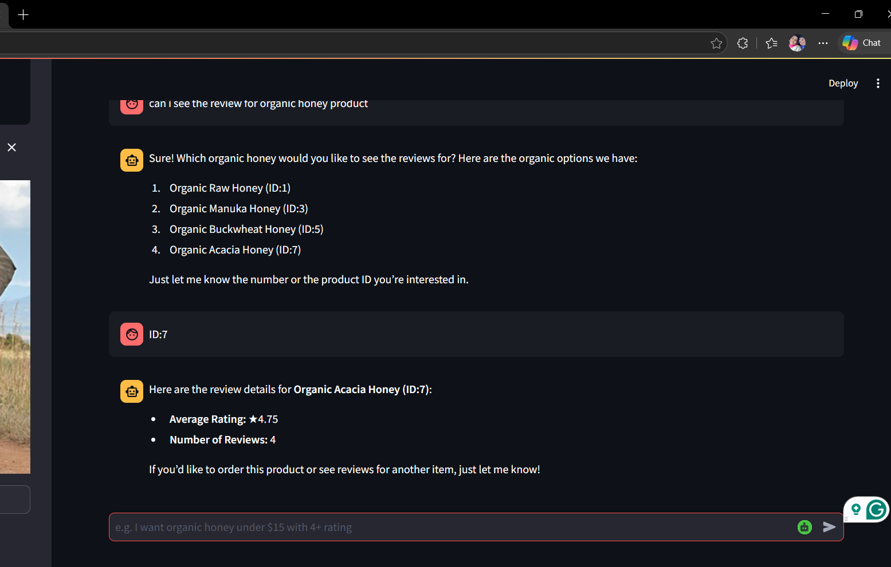

# 🛍️ AI Shopping Agent

An intelligent **AI-powered shopping assistant** built with **Streamlit + LangChain + Groq**, designed to help users discover, filter, and purchase products through natural conversation — including **image-based product search**.

---

## 📸 Screenshots

<p align="center">
  
</p>

<p align="center">
  
</p>

---

## 🚀 Features

* 💬 **Conversational Shopping**
  Ask naturally: *“Show organic honey under $15 with 4+ rating”*

* 🔍 **Smart Filtering**
  Filter by price, category, organic tag, and ratings

* 🖼️ **Image-Based Search**
  Upload a product image to find similar items using a multimodal model

* 🛒 **Order Placement**
  Place orders directly through chat (e.g., *“order number 2”*)

* 🧠 **Multimodal AI**
  Uses a single model for both **text + image understanding**

---

## 🧱 Tech Stack

* **Frontend:** Streamlit
* **Backend:** Python
* **AI Framework:** LangChain
* **LLM Provider:** Groq
* **Model:** `openai/gpt-oss-120b`
* **Database:** SQLite (`store.db`)

---

## ⚙️ Setup Instructions

### 1. Create Virtual Environment

```bash
python -m venv venv
source venv/bin/activate      # Windows: venv\Scripts\activate
```

### 2. Install Dependencies

```bash
pip install -r requirements.txt
```

### 3. Configure API Key

Get your key from: https://console.groq.com/keys

```bash
cp .env.example .env
```

Add inside `.env`:

```
GROQ_API_KEY=your_api_key_here
```

---

### 4. Database Setup

Pre-built `store.db` is already included with products and reviews.

To reset:

```bash
python setup_db.py
```

---

### 5. Run the App

```bash
streamlit run app.py
```

Open: http://localhost:8501

---

## 💡 Usage Examples

* *“I want organic honey under $15”*
* *“Show snacks with rating above 4”*
* Upload image → Click **Find similar products**
* *“Order number 2”*

---

## 📂 Project Structure

```
├── app.py
├── shopping_agent.py
├── reviews_api.py
├── setup_db.py
├── store.db
├── requirements.txt
├── .env.example
└── assets/
    ├── screenshot1.png
    └── screenshot2.png
```

---

## ⚠️ Model Notes

Previously used:

* `qwen/qwen3-32b`
* `meta-llama/llama-4-scout-17b-16e-instruct`

Now updated to:

```
openai/gpt-oss-120b
```

Check latest models:
https://console.groq.com/docs/models

---

## 🧩 Notes

* No separate backend server required
* Uses SQLite (lightweight, local database)
* Orders stored in `store.db`

---

## 🌟 Future Improvements

* Personalized recommendations
* Payment integration
* Multi-user authentication
* Real-time inventory updates

---

## 📌 Summary

A practical **AI agent application** combining:

* Conversational AI
* Smart filtering
* Multimodal search
* End-to-end shopping experience

---

Made with curiosity✨
